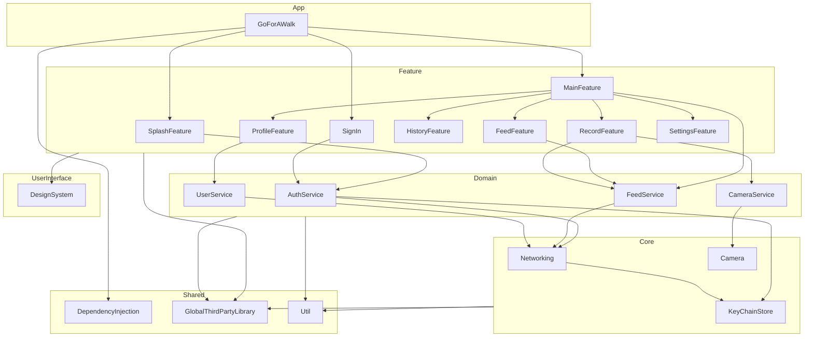
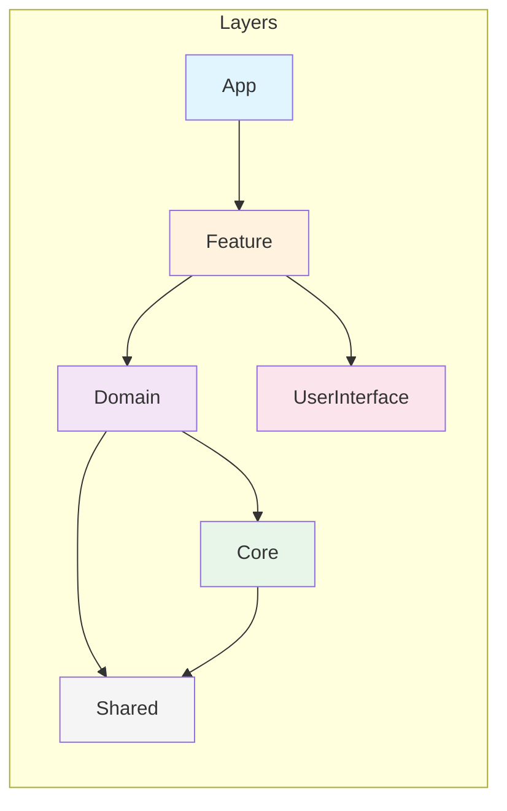

# 걷는

산책과 운동을 즐기는 사람들을 위한 iOS 앱입니다.

## 아키텍처

이 프로젝트는 **Tuist**를 활용한 모듈화 아키텍처와 **SwiftUI + TCA(The Composable Architecture)**를 기반으로 개발되었습니다.

### 모듈 구조

```
GoForAWalk
├── App
│   └── GoForAWalk (메인 앱)
├── Feature
│   ├── SplashFeature (스플래시)
│   ├── SignIn (로그인)
│   ├── MainFeature (메인 탭)
│   ├── FeedFeature (피드)
│   ├── HistoryFeature (히스토리)
│   ├── ProfileFeature (프로필)
│   ├── RecordFeature (기록)
│   └── SettingsFeature (설정)
├── Domain
│   ├── AuthService (인증)
│   ├── CameraService (카메라)
│   ├── FeedService (피드)
│   └── UserService (사용자)
├── Core
│   ├── Networking (네트워크)
│   ├── KeyChainStore (키체인)
│   └── Camera (카메라)
├── UserInterface
│   └── DesignSystem (디자인 시스템)
└── Shared
    ├── DependencyInjection (의존성 주입)
    ├── GlobalThirdPartyLibrary (외부 라이브러리)
    └── Util (유틸리티)
```

### 모듈 의존성 다이어그램



### 레이어 의존성 규칙



### 레이어 설명

| 레이어 | 설명 | 모듈 |
|--------|------|------|
| **App** | 앱 진입점, 의존성 조립 | GoForAWalk |
| **Feature** | 사용자 인터페이스, TCA Reducer | Splash, SignIn, Main, Feed, History, Profile, Record, Settings |
| **Domain** | 비즈니스 로직, 서비스 | Auth, Camera, Feed, User |
| **Core** | 순수 기능성 모듈 | Networking, KeyChain, Camera |
| **UserInterface** | 공통 UI 컴포넌트 | DesignSystem |
| **Shared** | 공용 유틸리티 | DependencyInjection, GlobalThirdPartyLibrary, Util |

### TCA Feature 모듈 구조

각 Feature 모듈은 Interface/Sources 분리 패턴을 따릅니다:

```
Feature/[Name]/
├── Interface/
│   ├── [Name].swift          # Reducer 프로토콜/인터페이스
│   └── [Name]View.swift      # SwiftUI View
├── Sources/
│   └── [Name].swift          # Live 구현체
├── Testing/
│   └── [Name]+Testing.swift  # 테스트용 Mock
└── Tests/
    └── [Name]Tests.swift     # 단위 테스트
```

## 기술 스택

| 분류 | 기술 |
|------|------|
| **Language** | Swift 6 |
| **UI Framework** | SwiftUI |
| **Architecture** | TCA (The Composable Architecture) |
| **Modularization** | Tuist |
| **Networking** | Alamofire |
| **Authentication** | Kakao SDK, Sign in with Apple |
| **Analytics** | Firebase Analytics |
| **Crash Reporting** | Firebase Crashlytics |

## 시작하기

### 요구사항

- **Xcode**: 16.0+
- **iOS**: 18.0+
- **Tuist**: 4.x

### 설치 및 실행

```bash
# 1. Tuist 설치 (mise 사용)
mise install tuist

# 2. 의존성 설치 및 프로젝트 생성
make generate

# 3. Xcode에서 열기
open GoForAWalk.xcworkspace
```

## 사용 가능한 명령어

### 기본 명령어

| 명령어 | 설명 |
|--------|------|
| `make init` | 프로젝트 이름과 organization을 입력하여 프로젝트 기본 세팅 |
| `make signing` | 프로젝트 Team Signing |
| `make generate` | 외부 디펜던시 fetch 및 프로젝트 generate |
| `make clean` | 전체 xcodeproj, xcworkspace 파일 삭제 |
| `make reset` | tuist clean 후, 전체 xcodeproj, xcworkspace 파일 삭제 |

### 개발 도구

| 명령어 | 설명 |
|--------|------|
| `make module` | 새로운 모듈 생성 |
| `make dependency` | 디펜던시 추가 |

### CI/CD 명령어

| 명령어 | 설명 |
|--------|------|
| `make ci_generate` | CI용 프로젝트 generate (SwiftLint 제외) |
| `make cd_generate` | CD용 프로젝트 generate (SwiftLint 제외) |

## 개발 가이드라인

### TCA 패턴

모든 Feature 모듈은 TCA 패턴을 따릅니다:

```swift
@Reducer
public struct SomeFeature: Sendable {
    @ObservableState
    public struct State: Equatable { ... }

    public enum Action {
        case viewAction
        case delegate(Delegate)

        public enum Delegate { ... }
    }

    public var body: some ReducerOf<Self> {
        Reduce { state, action in
            // 상태 변경 로직
        }
    }
}
```

### 모듈 간 의존성 규칙

1. **상위 → 하위만 허용**: App → Feature → Domain → Core
2. **같은 레이어 최소화**: Feature 간 직접 의존 지양
3. **Interface 분리**: 모듈 간 통신은 Interface를 통해
4. **Core는 비즈니스 로직 없음**: 순수 기능성 모듈만

## 문의

프로젝트에 대한 질문이나 제안사항이 있으시면 Issues를 통해 연락해주세요.
