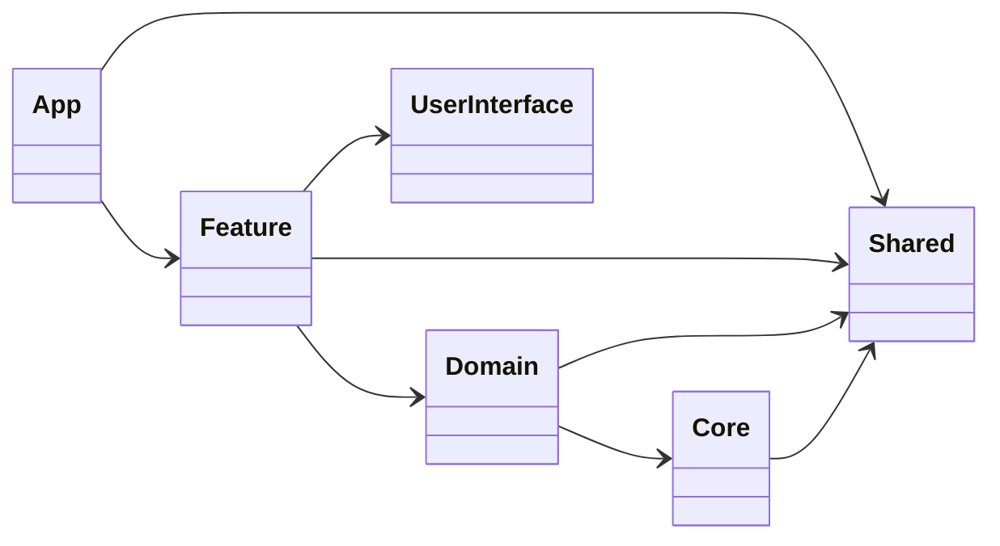
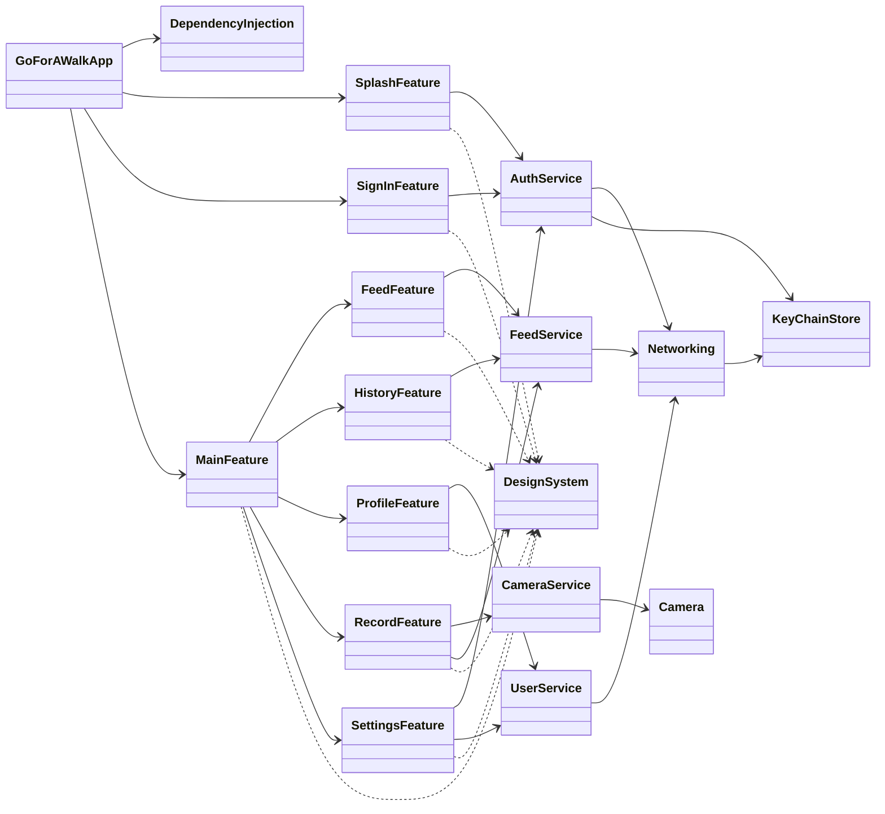
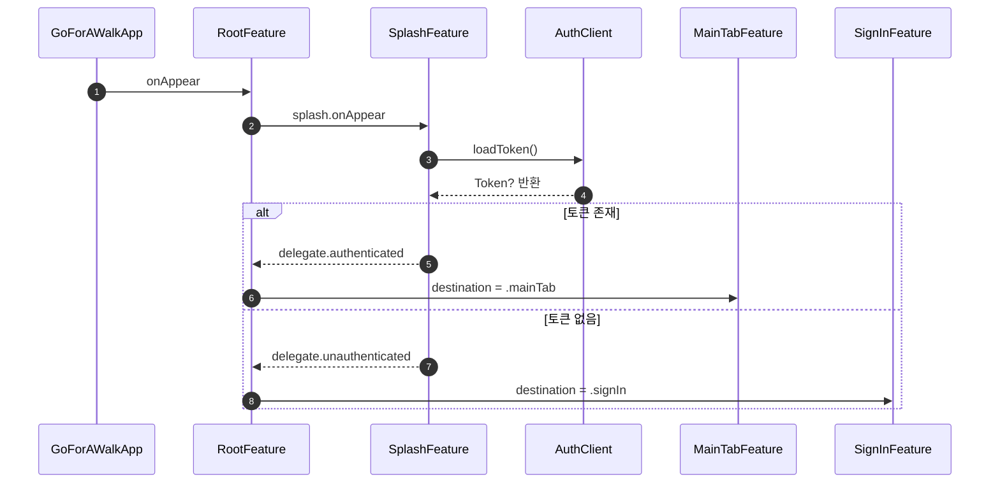

# 걷는 (GoForAWalk)

산책 기록을 남기고 공유하는 iOS 앱입니다.  
이 프로젝트는 `Tuist` 기반 모듈 아키텍처와 `SwiftUI + TCA`로 구성되어 있습니다.

## 프로젝트 구조

아래 구조는 현재 저장소의 `Project.swift` 기준 실제 활성 모듈을 반영합니다.

```text
GoForAWalk
├── Projects
│   ├── App
│   ├── Feature
│   │   ├── SplashFeature
│   │   ├── SignIn
│   │   ├── MainFeature
│   │   ├── FeedFeature
│   │   ├── HistoryFeature
│   │   ├── ProfileFeature
│   │   ├── RecordFeature
│   │   └── SettingsFeature
│   ├── Domain
│   │   ├── AuthService
│   │   ├── CameraService
│   │   ├── FeedService
│   │   └── UserService
│   ├── Core
│   │   ├── Networking
│   │   ├── KeyChainStore
│   │   └── Camera
│   ├── Shared
│   │   ├── DependencyInjection
│   │   ├── GlobalThirdPartyLibrary
│   │   └── Util
│   └── UserInterface
│       └── DesignSystem
├── Plugin
├── Tuist
├── Scripts
├── XCConfig
├── Package.swift
├── Tuist.swift
└── Workspace.swift
```

## 레이어 구성

| Layer | 모듈 | 역할 |
|---|---|---|
| App | GoForAWalk | 앱 진입점, RootFeature 실행 |
| Feature | Splash, SignIn, Main, Feed, History, Profile, Record, Settings | 화면/상태/유저 액션 처리 (TCA) |
| Domain | AuthService, CameraService, FeedService, UserService | 비즈니스 API 클라이언트 |
| Core | Networking, KeyChainStore, Camera | 인프라/저수준 기능 |
| UserInterface | DesignSystem | 공통 UI 컴포넌트/리소스 |
| Shared | DependencyInjection, GlobalThirdPartyLibrary, Util | 의존성 조립, 외부 라이브러리 집약, 공통 유틸 |

## UML

### 1) 레이어 의존성 UML



### 2) 모듈 의존성 UML



### 3) 앱 시작 플로우 UML (Sequence)



## 타깃 구성 패턴

모듈은 `Interface` / `Sources` 분리를 기본으로 사용합니다.

- Feature/Core/Domain: `Interface`, `Sources`, `Testing`, `Tests` (모듈별로 `Demo`, `UITests` 선택)
- Shared/UserInterface: 목적에 맞게 단일 `Sources` 또는 `Demo` 포함

예시:

```text
Projects/Feature/FeedFeature
├── Interface
├── Sources
├── Testing
├── Tests
├── Demo
└── UITests
```

## 기술 스택

| 분류 | 내용 |
|---|---|
| Language | Swift 6 |
| UI | SwiftUI |
| Architecture | TCA (The Composable Architecture) |
| Build/Modularization | Tuist (`.tuist-version`: 4.88.0) |
| Networking | Alamofire |
| Auth | Kakao SDK, Sign in with Apple |
| Analytics/Crash | Firebase Analytics, Crashlytics |

## 시작하기

### 요구사항

- Xcode 16+
- iOS Deployment Target 18.0+
- Tuist 4.88+

### 설치 및 실행

```bash
# 1) Tuist 설치 (mise 사용 시)
mise install tuist

# 2) 의존성 설치 + 프로젝트 생성
make generate

# 3) 워크스페이스 열기
open GoForAWalk.xcworkspace
```

## Make 명령어

| 명령어 | 설명 |
|---|---|
| `make init` | 프로젝트 기본 환경 초기화 |
| `make signing` | 코드 서명 설정 |
| `make generate` | 의존성 설치 + 프로젝트 생성 |
| `make ci_generate` | CI 환경용 generate |
| `make cd_generate` | CD 환경용 generate |
| `make module` | 신규 모듈 생성 |
| `make dependency` | 디펜던시 추가 |
| `make clean` | 생성된 `.xcodeproj`, `.xcworkspace` 정리 |
| `make reset` | `tuist clean` + 생성 파일 정리 |

